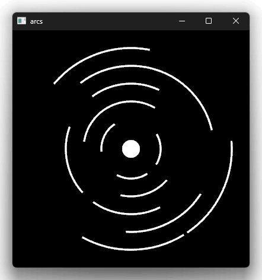
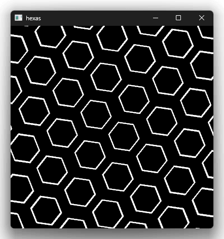

# nannou_sketches

bevy 0.19, nannou 0.20 (forked version, https://github.com/nannou-org/nannou/pull/1098)

```bash
$ cargo run --example # this shows the list
```

## Screenshots

|[arcs](examples/arcs.rs)|[hexas](examples/hexas.rs)|
|---|---|
|||

## Hot reloading (dev)

### Watch file and Auto restart

```bash
$ cargo install cargo-watch
$ cargo watch -x "run --example [example_name]"
```

(not truly hot reloading, but nearly the same.)

### Asset hot reloading (such as wgsl)

```bash
$ cargo run --example [example_name] --features=hot_reload
```

## License

CC-BY-SA 4.0

Copyright (c) 2026 Fumiya Funatsu
